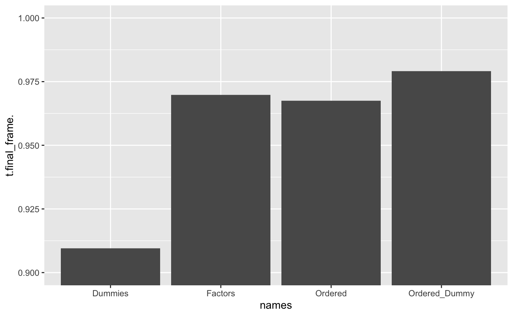

---
output:
  pdf_document: default
  html_document: default
---
```{r reprex-options, include = FALSE}
options(
  keep.source = TRUE,
  rlang_backtrace_on_error_report = "full",
  crayon.enabled = FALSE,
  reprex.current_venue = "gh"
)
```

```{r, results = 'asis', echo = FALSE, include = file.exists('.Rprofile'), eval = file.exists('.Rprofile')}
cat(sprintf("*Local `.Rprofile` detected at `%s`*", normalizePath(".Rprofile")))
```

---
output:
  reprex::reprex_document:
    venue: "gh"
    advertise: FALSE
    session_info: TRUE
    style: TRUE
    comment: "#;-)"
    tidyverse_quiet: FALSE
    std_out_err: TRUE
knit: reprex::reprex_render
---
# Encoding Categorical Predictors
Agazzi Ruben <br />
Davide Dell'Orto  <br />
Hellem Carrasco  <br />

## Abstract

This is a comprehensive analysis (based on Chapter 5 of *Feature engineering and selection: a practical approach for predictive models* by Kuhn and Johnson) on how categorical, and more generally non numerical data can be encoded into a numerical form, in order to be used by all types of models.
In particular will be addressed how to manage unordered and ordered categorical data, and also how to extract features from textual data.

## Encoding of unordered categorical data

Handling categorial data is a very important step during the implementation of a statistical or machine learning model. Most of the models does not accept categorical data, but only numerical data. The only models that accepts this type of data are tree-based model which can handle this type of data by default.

### Dummy Variables

The most basic approach used for handling unordered categorical data, consists in creating dummy or indicator variables. The most common form is creating binary dummy variables for categorical predictors: if the categorical predictor can assume 3 values we can create 2 binary dummy variables where value 1 will be, for example, d1=1 and d2=0, value 2 will be d1=0 and d2=1 and where value 3 will be d1=0 and d2=0. We could also represent this type of categorical data with 3 dummy variables, but this approach could lead, sometimes, to problems: some models, in order to estimate their parameters, needs to invert the matrix $(X'X)$, if the model has an intercept an additional column of one for all columns is added to the $X$ matrix; if we add the new 3 dummy variables this will add to the previous intercept row, and this linear combination would prevent the $(X'X)$ matrix to be invertible. This is the reason why we encode $C$ different categories into $C-1$ dummy variables

### Code

This piece of code shows a way of encoding the seven days of weeks into 6 dummy variables
```{r}
library(tidymodels)
library(FeatureHashing)
library(stringr)
library('fastDummies')
days_of_week <- c("Sunday", "Monday", "Tuesday", "Wednesday", "Thursday","Friday", "Saturday")
test_df <- data.frame(days_of_week)
test_df <- dummy_cols(test_df, select_columns = c('days_of_week'))
test_df = test_df[-c(5)]
```


## Encoding predictors mith many categories
We may have a problem by encoding values using simple dummy variables: if the categorical predictor can assume a large number of different values, like for example the ZIP code, we will end up with too many dummy variables.
If we make a resampling on this type of data there is also the problem where some dummy variables will assume an always 0 value: this case is called _zero-variance predictor_. Using the example of ZIP codes, highly populated areas will lead to higher frequencies of the same ZIP codes, while some will be very rare, in this case the dummy variables could become _near-zero-variance predictors_. In this cases we could remove _zero-variance and near-zero-variance predictors_.

### Hashing functions
Instead of removing the mentioned types of predictors we could use an hashing function to map the values into fewer values, and then use these values to create dummy variables. the process of using hashes to create dummy variables is called _feature hasing_ or _hash trick_.
The process of hashing features is:

#. Calculate the hash from the feature value, which is an integer value.
#. Calculate the new feature value, if we want 16 different values we calculate _(hashValue mod 16) +1_

Some considerations needs to be done: because of the nature of the hashing functions, sometimes we will have collisions. Collisions occurs when two different values has different hashing. In statistics this is an aliasing problem. A way to solve this problem consists into using signed hashes, so instead of only 0 and 1 values for dummy variables, we can also have -1 value in order to reduce aliasing. To see if this method is effectively useful, we made a simulation consisting in a test predictor containing $10^4$ different categories, where each category is a random 20 characters string. We created different hash mappings of different sizes, and for each hash of specified size we created the signed and unsigned version, and we calculated the collision rates of both versions. Finally we made this simulation for 10 times and averaged all the results. Using a line plot we can see that the signed version of each hash has lower collision rates than the unsigned versions.


### Problems of feature hashing

The process of feature hashing can lead to some problems:

#. Collisions: Even with signed hashes collisions can appear, and in this cases is more difficult to understand the impact of a category on the model because of this aliasing problem.
#. Collision meaning: if two categories collides, this does not mean that they share something in common or have some type of correlation or similarity.
#. Collision probability: as hashing function does not have information about the distribution of data, rarer categories can collide with higher frequency categories, in this case the higher frequency category will have much more influence.

### Code 
This piece of code shows how feature hashing can be done. The dataset used is the OkCupid dataset and the categorical predictor used was the _where_town_ column of the dataset.
```{r eval=FALSE}
library(tidymodels)
library(FeatureHashing)
library(stringr)

options(width = 150)


load("./Datasets/okc.RData")

towns_to_sample <- c(
  'alameda', 'belmont', 'benicia', 'berkeley', 'castro_valley', 'daly_city', 
  'emeryville', 'fairfax', 'martinez', 'menlo_park', 'mountain_view', 'oakland', 
  'other', 'palo_alto', 'san_francisco', 'san_leandro', 'san_mateo', 
  'san_rafael', 'south_san_francisco', 'walnut_creek'
)

# Sampled locations from "where_town" column
locations_sampled <- okc_train %>% dplyr::select(where_town) %>% distinct(where_town) %>% arrange(where_town)

hashes <- hashed.model.matrix(
  ~ where_town,
  data = locations_sampled,
  hash.size = 2^4,
  signed.hash=FALSE,
  create.mapping=TRUE
)

hash_mapping = hash.mapping(hashes)
names(hash_mapping) = str_remove(names(hash_mapping), 'where_town')

# Takes hash mapping, converts to dataframe, set new columns names, calculate hash over name to have original integer value, filter for selected cities 
binary_calcs = hash_mapping %>% enframe() %>% set_names(c('town', 'column_num_16')) %>% mutate(integer_16 = hashed.value(names(hash_mapping))) %>% dplyr::filter(town %in% towns_to_sample) %>% arrange(town)

hashes_df = hashes %>% 
  as.matrix() %>%
  as_tibble() %>%
  bind_cols(locations_sampled) %>%
  dplyr::rename(town = where_town) %>% 
  dplyr::filter(town %in% towns_to_sample) %>% 
  arrange(town)


# Making a signed hasing version in order to prevent aliasing

hashes_signed <- hashed.model.matrix(
  ~ where_town,
  data = locations_sampled,
  hash.size = 2^4,
  signed.hash=TRUE,
  create.mapping=TRUE
)
hashes_df_signed = hashes_signed %>% 
  as.matrix() %>%
  as_tibble() %>%
  bind_cols(locations_sampled) %>%
  dplyr::rename(town = where_town) %>% 
  dplyr::filter(town %in% towns_to_sample) %>% 
  arrange(town)


```

```{r eval=FALSE}
library(tidymodels)
library(FeatureHashing)
library(stringr)
library(stringi)
# Generate a test predictor with 10000 different categories

# Function used to calculate hash mapping collision rate, it can be specified an hash size and if the hash should be signed or not
getHash_collision_percentage <- function(dataframe, signed, size){
  #Create hases
  hashes <- hashed.model.matrix(~fake_predictor,
  data = dataframe,
  hash.size = size,
  signed.hash=signed,
  create.mapping=TRUE
);
  mapping <- hash.mapping(hashes);
  # Group same hashes 
  hashes_df_signed = hashes %>% 
  as.matrix() %>%
  as_tibble()%>%group_by_all() %>% summarise(COUNT = n())
  # Calculate collision rate
  1 - (nrow(hashes_df_signed) / nrow(test_df))
}
#Make a simulation 10 times
for (iteration_number in 1:10) {
  #Creation of 10k categories fake predictor
  fake_predictor = stri_rand_strings(10000, 20)
  fake_predictor = c(fake_predictor, fake_predictor)
  
  result_df = data.frame()
  #Create dataframe from fake predictor
  test_df = data.frame(fake_predictor)
  #Creation of hashes of various sizes and both signed and unsigned versions
  unsigned_2048 = getHash_collision_percentage(test_df, FALSE, 2^11)
  signed_2048 = getHash_collision_percentage(test_df, TRUE, 2^11)
  
  unsigned_4096 = getHash_collision_percentage(test_df, FALSE, 2^12)
  signed_4096 = getHash_collision_percentage(test_df, TRUE, 2^12)
  
  
  unsigned_8192 = getHash_collision_percentage(test_df, FALSE, 2^13)
  signed_8192 = getHash_collision_percentage(test_df, TRUE, 2^13)
  
  unsigned_16384 = getHash_collision_percentage(test_df, FALSE, 2^14)
  signed_16384 = getHash_collision_percentage(test_df, TRUE, 2^14)
  
  unsigned_32768 = getHash_collision_percentage(test_df, FALSE, 2^15)
  signed_32768 = getHash_collision_percentage(test_df, TRUE, 2^15)
  
  #Add row with results to final dataframe
  result_df = rbind(result_df, c(unsigned_2048, signed_2048, unsigned_4096, signed_4096, unsigned_8192, signed_8192, unsigned_16384, signed_16384, unsigned_32768, signed_32768, iteration_number))
}
#Make average of simulation results
averaged_results = colMeans(result_df)
average_df = data.frame(averaged_results)
average_df_filtered <- data.frame(average_df[c(-11),])
rownames(average_df_filtered) <- c("unsigned_2048","signed_2048", "unsigned_4096", "signed_4096","unsigned_8192", "signed_8192", "unsigned_16384", "signed_16384", "unsigned_32768", "signed_32768")
average_df_filtered$signed = c(FALSE,TRUE,FALSE,TRUE,FALSE,TRUE,FALSE,TRUE,FALSE,TRUE)
average_df_filtered$hashSize = c(2048,2048, 4096, 4096,8192, 8192, 16384, 16384, 32768, 32768)
final_df <- as_tibble(average_df_filtered) %>% rename(CollisionRate = average_df.c..11....)
library(ggplot2)

#Plot of the results
ggplot(data = final_df,aes(x=hashSize, y=CollisionRate))+ geom_line(aes( colour=signed, group=signed)) + geom_point(aes( colour=signed, group=signed))

```


## The problem of novel categories

When we handle categorical data, we can come across a particular problem: using specific categories on trained models, that were trained with data that does not contain the mentioned category. For example, if we use a predictor that indicates the city where a person lives, it is very likely that in the training dataset will not contain all possible cities on the planet.

### How to solve this problem

A simple way to solve this problem, consists into adding an "other" category to the datasets: this permits to adapt the model to unseen categories, just by putting the unseen categories into the "other" category. We must ensure that the "other" category is present in the training ant test dataset.

## Supervised encoding methods

When new levels appear after training or when predictors have many possible values, it's recommended to encode using *supervised methods*, which can be implemented in different modalities.

### Likelihood encoding

The first type consists of measuring the effect on the outcome by calculating a statistic for the categorical predictors and using this to represent the factor levels in the model. For example we can calculate the odds which is the ratio between two rates of occurrence (probabilities of complementary events), p and (1-p). A model like a logistic regression can then model the log-odds (*ln* of odds) as a function of the predictors. If a single categorical predictor is included in the model, then the log-odds can be calculated for each predictor value and can be used this as the encoding.


```{r library, results="hide", message=FALSE, warning=FALSE}
library(tidyverse)
library(dplyr)
library(embed)
library(ggplot2)
library(gridExtra)
library(pander) # for table layout
```

```{r odds, tidy=TRUE, include=TRUE, warning=FALSE, eval=FALSE}
load("./Datasets/okc.RData")
load("./Datasets/okc_binary.RData")

sample_towns <- c(
  "belvedere_tiburon", "berkeley", "martinez", "mountain_view", "san_leandro",
  "san_mateo", "south_san_francisco")

# get raw rates and log-odds

okc_props <- 
  okc_train %>%
  group_by(where_town) %>%
  summarise(
    rate = round(mean(Class == "stem"),3),
    n = length(Class),
    raw  = log(rate/(1-rate))
  ) %>%
  mutate(where_town = as.character(where_town)) %>% 
  rename(location = where_town)

```

The problems with this method begin when a categorical predictor has a single value and the log-odds should then be infinite (since it ranges from *-inf* to *+inf*). Generally this gets cut off at a large inaccurate value. To overcome this limit the so called *shrinkage methods* can be applied, where the overall log-odds is determined and, if the quality of the data within a factor level is poor (small sample size or, for numeric outcomes, a large variance within the data for that level), then its effect estimate can be biased towards an overall estimate that disregards the levels of the predictor. These methods can also move extreme estimates towards the middle of the distribution.

### Bayesian likelihood encoding

There are different methods of shrinking, the most common is based on the prior distribution for the estimates, a theoretical distribution that represents the overall distribution of effects, like for example a normal distribution. Bayesian methods take the observed data and blend it with the prior distribution to come up with a posterior distribution that is a combination of the two. Also, when a new level appears after training, its effect can be estimated using the mean of the posterior distribution.

```{r shrink, include=TRUE, warning=FALSE, eval=FALSE}
# fit a generalized linear model and return encoding

shrink_rec <- 
  recipe(Class ~ ., data = okc_train) %>%
  step_lencode_bayes(
    where_town,
    outcome = vars(Class),
    verbose = TRUE,
    options = list(
      chains = 5, 
      iter = 1000,
      cores = min(parallel::detectCores(), 5),
      seed = 18324)) %>% prep()

shrinken <- 
  tidy(shrink_rec, number = 1) %>%
  select(-terms, -id) %>%
  setNames(c("location", "shrunk")) %>% 
  full_join(okc_props, by="location") # merge with raw log-odds table

shrinken %>%
  filter(location %in% sample_towns) %>%
  relocate(shrunk, .after=raw) -> shrinken_sample # sample and move columns
shrinken_sample$location <- str_replace_all(shrinken_sample$location, "_", " ")

shrinken_sample %>% add_row(tail(shrinken, 1)) %>% pander(round=3)
```

The shrinking effect is shown below: plot a. compares the raw with the shrunken log-odds, while plot b. shows the magnitude of the estimates (mean between raw and shrinken odds) versus the difference between the two.
```{r plots, warning=FALSE, eval=FALSE}
# plots where size of the points is Log of n. osservations

odds_rng <- extendrange(c(shrinken$raw, shrinken$shrunk), f = 0.01) # log-odds range

plot_a <-
  ggplot(shrinken) +
  geom_point(aes(x = raw, y = shrunk, size = log10(n)), alpha = 0.4, colour="red") + 
  scale_size(range = c(.1, 6)) +
  geom_abline(alpha = .4, lty = 2)  +
  xlim(odds_rng) +
  ylim(odds_rng) +
  xlab("Raw Log-Odds") +
  ylab("Shrunken Log-Odds") +
  theme(legend.position="None")

plot_b <- 
  ggplot(shrinken) +
  geom_point(aes(x = .5*(raw + shrunk), y = raw - shrunk, size = log10(n)), alpha = 0.4, colour="red") + 
  scale_size(range= c(.1, 6)) + 
  geom_hline(alpha = .4, lty = 2, yintercept = 0) + 
  xlab("Average Estimate") +
  ylab("Raw - Shrunken") +
  theme(legend.position="None")

ggpubr::ggarrange(plot_a, plot_b,
                  labels=c("a.","b."))
```

One issue with effect encoding is that it increases the possibility of overfitting since the estimated effects are taken from one model and put into another model and if these two models are based on the same data it can lead to overfitting. Also, the use of summary statistics as predictors can drastically underestimate the variation in the data.

### Word embedding

Another approach comes from the analysis of textual data: with *word embedding* the idea is to represent the categorical predictors as vectors and this cane be done with different techniques in order to avoid sparsity. Once the number of new features is specified, the model takes the traditional indicators variables and randomly assigns them to one of the new features. The model then tries to optimize both the allocation of the indicators to features as well as the parameter coefficients for the features themselves. It’s common to use as a loss function the root mean squared error for numeric outcomes and cross-entropy for categorical outcomes.

A neural network structure can also be used, where the encoding happens in the hidden layers. This type of model can include a set of other unrelated predictors in order to adjust and better estimate the encoding in presence of other potentially important features.
```{r embed, include=TRUE, warning=FALSE, eval=FALSE}
# merge training data with the keyword indicators

keywords <- names(okc_train_binary)[-1]

okc_embed <-
  okc_train %>% 
  select(Class, where_town, profile) %>%
  full_join(okc_train_binary, by = "profile")

# doubles instead of binary integers as tensorflow input

okc_embed[, keywords] <- apply(okc_embed[, keywords], 2, as.numeric)

# use the entity embedding

set.seed(355)
nnet_rec <- 
  recipe(Class ~ ., data = okc_embed) %>% 
  step_embed(
    where_town,
    outcome = vars(Class),
    num_terms = 3,
    hidden_units = 10,
    predictors = vars(!!!(keywords)),
    options = embed_control(
      loss = "binary_crossentropy",
      epochs = 30,
      validation_split = 0.2,
      verbose = 0
    )) %>% prep()

word_embed <- 
  tidy(nnet_rec, number = 1) %>%
  select(-terms, -id) %>%
  setNames(c(paste0("Feature", 1:3), "location"))

word_embed_sample <- 
  shrinken %>%
  inner_join(word_embed, by = "location") %>%
  select(location, rate, n, raw, shrunk, Feature1, Feature2, Feature3) %>% 
  filter(location %in% sample_towns)

word_embed_sample$location <- str_replace_all(word_embed_sample$location, "_", " ")

pander(word_embed_sample, round=3)

```

The figure below shows the relationship between the resulting features and the raw log-odds.

```{r fplot, include=TRUE, warning=FALSE,eval=FALSE}
word_embed %>%
  full_join(okc_props, by = "location") %>%
  gather(feature, value, -rate, -raw, -n, -location) %>% 
  ggplot() +
  geom_point(aes(x = value, y = raw, size=log10(n)), alpha = 0.4, colour="red") + 
  facet_wrap(~feature, scale = "free_x") + 
  ylab("Raw Odds-Ratio") + 
  theme(legend.position = "top") + 
  xlab("Feature Value") + 
  scale_size(range = c(.1, 6)) +
```

## Encoding of ordered data

Some categorical data can be ordered. One example of ordered categorical data, can be a review with values that are like "bad", "normal" and "good". In this case "bad" should have a different meaning with respect to the "good" case during the training of a model, and we should not only indicate the presence of the value "good" or "bad". 

### How to encode ordered categorical data

Ordered categorical data can have a different type of relationship between the values: for example the values can have a linear relationship or a quadratic relationship. We must encode these data with the right relationship in order to let the model understand this type of relationship. The encoding used to maintain this type of relationship is called _Polynomial Contrast_. A contrast has the characteristic that is a single comparison (one degree of freedom) and the sum of the coefficients is equal to zero.
Polynomial contrast is useful, because it can represent linear relations, but also non linear shapes too: for example we can make a quadratic polynomial contrast, cubic polynomial contrast, etc. Polynomial constrast is also useful because it can be done on data with any number of ordered factors; the only "drawback" is that the complexity of the contrast can be, at most, equal to the number of categories of the predictor minus one: for example, if our ordered categorical predictor has three different levels, we can make only a linear and quadratic polynomial contrast. We can use _polynomial contrast_ to investigate multiple relationships at the same time by including them in the same model, for example both linear and quadratic polynomial contrast.

### Drawbacks 

A drawback of the polynomial contrast is that it may not relate directly the predictor to the response: for example, in the case where two levels of the categorical ordered predictor are very close, like in the case of "low" and "middle", polynomial contrast does not encode well this situation and does not have particular effective response in modeling the predictor's trend.
Another drawback happens when we have a high number of different $C$ categories: because we can make at most $C-1$ degree polynomial contrast, if the number of $C$ categories is very high, we can have higher grade contrasts, but in practice it has be seen that polynomial contrast is usually useful up to the quadratic polynomial contrast; in this case we might want to limit the maximum polynomial degree of the contrasts.

### Alternatives

Some alternatives to polynomial contrast are:

#. Treat the predictors as unordered factors. This can be useful if the pattern of the categorical data is not polynomial, but if the underlying patter is linear or quadratic, unordered dummy variables may not uncover this trend.
#. Manually translate the categories into a set of numberic score, using domani-specific knowledge of the data.

### Code

The following code illustrates how to obtain _polynomial contrast_ encoding for an ordered categorical predictor with 3 number of categories.

```{r eval=TRUE}
# Linear and quadratic polynomial contrasts are generated, the scores -1,0,1 can be seen as "bad", "medium" and "good" categories
zapsmall(contr.poly(3, scores=c(-1,0,1)))

```
As we can see from the results of the code the linear _polynomial contrast_ have as values -0.71, 0, 0.71 and for quadratic _polynomial contrast_ value have 0.41, -0.82, 0,41. As we can see the two set of values has sum equal to 0.

## Features from text data

Usually we can come around some textual data inside a dataset, for example a product description or a profile description. We need to find a way to extract some features from texts. One example can be searching for the presence of links inside the text. Like suggested in the book, we can make a new feature that indicates the presence of a link inside the profile description. This feature can be useful to be used to classify a profile, in order to predict if the profile belongs to a STEM or non-STEM person. With our testing dataset we found out that the profiles with a link in the description are 662, where 409 are STEM profiles and 253 are non stem profiles. The odds ratio of having a link in the STEM profiles is equal to 0.043, while the odds ratio of non-STEM profiles that have a link in the description is 0.026. This values makes us understand that the stem profiles that have a link in the description are 1.65 times higher than the non-STEM profiles with a link. To see if this proportion is reliable we made a confidence interval over the odds-ratio of profiles with link. The confidence interval at 95% have as lower bound 1.42 and as upper bound 1.96, in this case 1 is not included inside the interval, so we can say that this feature is not working only because of some random noise, but instead is a useful feature to distinguish profiles between STEM and non-STEM

### Other features
By following the previous analysis, other features can be obtained, like the presence of certain keywords, or the count itself of a specified word, the number of commas, hashtags, exclamation points, etc..
In this case it is useful to remember that some form of preprocessing should be done when working with textual data. The preprocessing steps can consists in:

#. Stop-word removal.
#. Removal of undesired elements, like html tags and other useless parts for the feature extraction.
#. Lemmatization or stemming in order to reduce the words to the same form, in order to accorpate the terms
#. Making al the text lowercase to normalize it.
#. Remove words that have a very low frequency.

### Analysis on text features
After the initial consideration about the presence of link feature and more in general of other features, we proceeded to make an analysis about the effectiveness of these features. To do so we used the different datasets, with different features inside, in order to train 4 different general linear models, in order to see how the performance is affected by the presence of different features.
The 4 datasets used for the training are:

#. Basic Ok Cupid dataset, with profile info consisting in 160 predictors, after creating dummy variables when needed.
#. Basic Ok Cupid dataset and text features like the number of occurences of urls, commas, exclamation points, etc.
#. Basic Ok Cupid dataset, text features and keyword features, like the presence of the "software" term in the description.
#. Basic Ok Cupid dataset, text features, keyword features and sentiment features, like the number of sentences, number of sentences written in first or third person, etc.

### Performance evaluation
In order to evaluate the performances of the 4 different models, we used the area under the ROC curve. The training also performs 10-Fold cross validation in order to have more precise results. In the end the performance is calculated as the average of the 10 folds performances.

### Cross validaiton

In order to have more precise results, we decided to use cross validation to train the models. Cross validation consists in splitting the data into k number of folds: for training are used $k-1$ folds, and the one fold left out is used to test the performance. Every fold is used for training and for testing. For every training performed we save the results, and in the end we make an average of the results. This can lead to better performance estimation, because the training is done on all the data after all the training step, and all the data is used for testing after all the testing step.

As we can see from the plot showing the performances, adding the simple text features to the dataset improves the area under the ROC curve by a little, while adding the keywords features greatly improves the performances. Adding the sentiment analysis features, on the other hand, decreases the performance with respect to the model trained with only the simple text features and keywords features.

### Other considerations

Another way of extracting text features can be the implementation of tf-idf statistics to identify important words: this statistic measures the grade of importance of a word inside its context, so if is more present locally it is considered more important, and inside the global context of documents, so if a word is rare among all documents its importance is considered bigger. The good thing of tf-idf is that it can consider not only single words, but n-grams, and this could lead to find more useful features inside our textual data.

### Code
The following code contains the analysis made on the odds ratio of the presence of link feature and the training and comparison of the 4 models with different feature sets.
```{r}
library(epitools)
load("./Datasets/okc.RData")

stem_data = okc_sampled[okc_sampled$Class == "stem",]
non_stem_data = okc_sampled[okc_sampled$Class != "stem",]
result_stem = grepl("http|https", stem_data$essays)
result_non_stem = grepl("http|https", non_stem_data$essays)

number_stem_with_link = sum(result_stem)
number_non_stem_with_link = sum(result_non_stem)


odds_stem = (number_stem_with_link ) / nrow(okc_sampled)
odds_ratio_stem = odds_stem / (1 - odds_stem)


odds_non_stem = (number_non_stem_with_link ) / nrow(okc_sampled)
odds_ratio_non_stem = odds_non_stem / (1 - odds_non_stem)

#Confidence interval for odds ratio

odds_ratio_matrix = matrix(c(number_stem_with_link, nrow(stem_data) - number_stem_with_link, number_non_stem_with_link, nrow(non_stem_data) - number_non_stem_with_link), nrow=2, ncol= 2)
odds_ratio_matrix
oddsratio.wald(odds_ratio_matrix)
```


```{r eval=FALSE}
library(caret)
library(tidymodels)
library(keras)
library(doParallel)
library(pROC)

load("./Datasets/okc.RData")
load("./Datasets/okc_other.RData")
load("./Datasets/okc_binary.RData")
load("./Datasets/okc_features.RData")

# joining all pre-computed features data sets: joins basic dataset, binary dataset and basic precomputed features.
okc_train = okc_train %>% full_join(okc_train_binary) %>%full_join(basic_features_train) %>% arrange(profile) %>% dplyr::select(-profile)

# Selecting pre-computed textual features names.
text_features = c("n_urls", "n_hashtags", "n_mentions", "n_commas", "n_digits",
    "n_exclaims", "n_extraspaces", "n_lowers", "n_lowersp", "n_periods",
    "n_words", "n_puncts", "n_charsperword")

#Specifying sentence features names.
sentiment_features = c("sent_afinn", "sent_bing", "n_polite", "n_first_person", "n_first_personp",
    "n_second_person", "n_second_personp", "n_third_person", "n_prepositions")

# Getting data set base features names.
base_features = names(okc_test)
base_features = base_features[!(base_features %in% c('Class','profile','essay_length','where_state'))]

#Getting pre-computed keyword features names.
keyword_features = names(okc_train_binary)
keyword_features = keyword_features[keyword_features != 'profile']

#Function used to get useful statistics from data and specified model
statistiche = function(data, lev= levels(data$obs), model = NULL){
  c(
    twoClassSummary(data = data, lev = levels(data$obs), model),
    prSummary(data = data, lev = levels(data$obs), model),
    mnLogLoss(data = data, lev = levels(data$obs), model),
    defaultSummary(data = data, lev = levels(data$obs), model)
  )
}

# used to get computational data of the models
okc_train_control = trainControl(
  method = "cv",
  classProbs = TRUE,
  summaryFunction = statistiche,
  returnData = FALSE,
  trim = TRUE,
  sampling = "down"
)

# keyword normalization
keyword_normalization = 
  #transforms dataset to recipe object with basic and keyword features
  recipe(Class ~.,data=okc_train[, c("Class", base_features, keyword_features)]) %>% 
  step_YeoJohnson(all_numeric()) %>%
  step_other(where_town) %>%
  # Creates dummy variables when needed
  step_dummy(all_nominal(), -all_outcomes()) %>%
  # Remove zero variance predictors
  step_zv(all_predictors()) %>%
  #Centers all predictors
  step_center(all_predictors()) %>%
  # Scale all predictors to have a std dev equal to 1
  step_scale(all_predictors())

okc_control_rand = okc_train_control
okc_control_rand$search = "random"

set.seed(49)

#Model with basic profile info

basic_model =
  recipe(Class ~ ., data=okc_train[, c('Class', base_features)]) %>% 
  step_YeoJohnson(all_numeric()) %>%
  step_other(where_town) %>%
  step_dummy(all_nominal(), -all_outcomes()) %>%
  step_zv(all_predictors())

set.seed(49)

glm_basic <- train(
  basic_model,
  data = okc_train,
  method = "glm",
  metric = "ROC",
  trControl = okc_train_control
)
basic_pred <- ncol(glm_basic$recipe$template) - 1

#Model with basic text features
text_rec <-
  recipe(Class ~ .,
         data = okc_train[, c("Class", base_features, text_features)]) %>%
  step_YeoJohnson(all_numeric()) %>%
  step_other(where_town) %>%
  step_dummy(all_nominal(), -all_outcomes()) %>%
  step_zv(all_predictors())

set.seed(49)
glm_text <- train(
  text_rec,
  data = okc_train,
  method = "glm",
  metric = "ROC",
  trControl = okc_train_control
)

text_pred <- ncol(glm_text$recipe$template) - 1

#Model with base info, text features and keywords
keyword_rec <-
  recipe(Class ~ .,
         data = okc_train[, c("Class", base_features, text_features, keyword_features)]) %>%
  step_YeoJohnson(all_numeric()) %>%
  step_other(where_town) %>%
  step_dummy(all_nominal(), -all_outcomes()) %>%
  step_zv(all_predictors())

okc_ctrl_keep <- okc_train_control
okc_ctrl_keep$savePredictions <- "final"

set.seed(49)
glm_keyword <- train(
  keyword_rec,
  data = okc_train,
  method = "glm",
  metric = "ROC",
  trControl = okc_ctrl_keep
)

keyword_pred <- ncol(glm_keyword$recipe$template) - 1

#Model with base info, text features, keywords and sentiment analysis

sent_rec <-
  recipe(Class ~ .,
         data = okc_train[, c("Class", base_features, keyword_features, sentiment_features)]) %>%
  step_YeoJohnson(all_numeric()) %>%
  step_other(where_town) %>%
  step_dummy(all_nominal(), -all_outcomes()) %>%
  step_zv(all_predictors())

set.seed(49)
glm_sent <- train(
  sent_rec,
  data = okc_train,
  method = "glm",
  metric = "ROC",
  trControl = okc_train_control
)

sent_pred <- ncol(glm_sent$recipe$template) - 1

#Data collection and visualization
features_groups <-
  c("Basic Profile Info", "+ Simple Text Features", "+ Keywords", "+ Keywords\n+ Sentiment")

glm_resamples <-
  glm_basic$resample %>%
  mutate(Features = "Basic Profile Info") %>%
  bind_rows(
    glm_text$resample %>%
      mutate(Features = "+ Simple Text Features"),
    glm_keyword$resample %>%
      mutate(Features = "+ Keywords"),
    glm_sent$resample %>%
      mutate(Features = "+ Keywords\n+ Sentiment")
  ) %>%
  mutate(Features = factor(Features, levels = features_groups))

glm_resamples_mean <-
  glm_resamples %>%
  group_by(Features) %>%
  summarize(ROC = mean(ROC))
glm_resamples_mean$Resample = 'Average'

temp_df = glm_resamples[,-c(2,3,4,5,6,7,8,9,10)]

full_df = rbind(glm_resamples_mean,temp_df )
library(ggplot2)


ggplot(data = subset(full_df, Resample != 'Average'),aes(x=Features, y=ROC, colour=Resample, group=Resample))+ geom_line() + geom_point() + geom_point(data = subset(full_df,  Resample == 'Average'),aes(x=Features, y=ROC,),color = 'black')+geom_line(data = subset(full_df,  Resample == 'Average'),size=1,aes(x=Features, y=ROC,),color = 'black')

```


## Factors versus Dummies

Does it matter how the predictors are encoded? A series of experiments was conducted, using the "carEvaluation" dataset to answer this question. 75% of the data was used as training set and a 10-folds cross-validation was applied. Two different models (Boosted 5.0 Rules and Random Forest) were fit to the data in their original form and to the dummy variables, both ordered and unordered.

### Accuracy evaluation

For each model, performance metrics were estimated using resampling as well as the total time to train and tune the model.
We compared them using AUC and accuracy. The plot below shows that, based on accuracy metric and for the Boosted C5.0 Rules model, the factor encodings are better than unordered dummy variables: this may be due to the fact that the dataset has 4 classes and all the predictors are categorical. Instead, no differences are basically visible in the case of ordered dummy variables.


For the Random Forest Model, using accuracy as measure, we saw that there is a strong difference when using unordered dummies and factor, where the factor encoded predictor have a higher value of accuracy. Instead, if the predictor is ordered, the dummy enconding performs a little better than the ordered factors predictor. It is important to say, that in every case the accuracy is very high, all above 90%, so the differences are not too big.


### Time evaluation

As we can see from the bar plot, the time spent on training the Boosted C5.0 Rules model, using factor encoding lead to a speedup of the training process. We must remember that the training time for this model is generally low, so the difference is in terms of a few seconds.


For the Random forest model, we can see from the plot of the results that in the case of factor encoding, the training time is significally faster, where the training time is almost half as the time of the models using dummies. This difference for this type of model is very important and it should be considered when choosing which type of encoding to use for this model


In conclusion, after these experiments, it is possible to say that, in this particular case, it is better to use predictors without converting them to dummy variables.

### Code
In this section there is the code used to perform this analysis, including the model training and plotting of results.

## Dummy

### Boosted C5.0
```{r eval=FALSE}

library(caret)
library(C50)
library(pROC)
# library(randomUniformForest)
seed = 50
carEvaluation=read.csv("car.data")
colnames(carEvaluation)=c("buying","maint","doors","persons","lug_boot","safety","class")
#training control with cross validation
ctrl <- trainControl(method = "cv", 
                     classProbs = TRUE,
                     summaryFunction = multiClassSummary)

set.seed(seed)
#Partition dataset into training and test
in_train <- createDataPartition(carEvaluation$class, p = 3/4, list = FALSE)
training <- carEvaluation[ in_train, ]
testing  <- carEvaluation[-in_train, ]
#training of the model
mod <- train(class ~ ., data = training, 
             method = "C5.0",
             tuneGrid = data.frame(trials = c(1:20, 10*(3:10)),
                                   model = "rules",
                                   winnow = FALSE),
             metric = "logLoss",
             trControl = ctrl)
#Getting results
test_pred <- predict(mod, testing, type = "prob")
test_pred$pred <- predict(mod, testing)
test_pred$obs <- factor(testing$class)
test_res <- multiClassSummary(data=test_pred, lev = levels(test_pred$obs))
test_res <- data.frame(t(test_res))
test_res$Data <- "Car Evaluation"
test_res$Model <- "Boosted C5.0 Rules"
test_res$Ordered <- "None"
test_res$Seed <- seed
test_res$Encoding <- "Dummy Variables"
test_res$Time <- mod$times$everything[3]

result <- multiclass.roc(test_pred$pred, predictor=test_pred$acc)

save(test_res, rs_res,
     file = file.path("./", "Salvataggi",
                      paste0("C5boostrules_dummy_", seed, ".RData")))
```
### Random Forest

```{r, eval=FALSE}
library(caret)
library(ranger)
library(pROC)
library(randomUniformForest)

###################################################################

seed <- 50

read.csv("car.data")

#Creating training control with cross validation

ctrl <- trainControl(method = "cv", 
                     classProbs = TRUE,
                     summaryFunction = multiClassSummary)

#Create training and test partition
set.seed(seed)
in_train <- createDataPartition(carEvaluation$class, p = 3/4, list = FALSE)
training <- carEvaluation[ in_train, ]
testing  <- carEvaluation[-in_train, ]
#training of random forest model
mod <- train(class ~ ., data = training, 
             method = "ranger",
             tuneLength = 10, 
             verbose = FALSE, 
             seed = seed + 1,
             num.threads = 1,
             num.trees = 1500,
             importance = "impurity",
             metric = "logLoss",
             trControl = ctrl)

#Getting results

test_pred <- predict(mod, testing, type = "prob")
test_pred$pred <- predict(mod, testing)
test_pred$obs <- factor(testing$class)

test_res <- multiClassSummary(test_pred, lev = levels(test_pred$obs))
test_res <- data.frame(t(test_res))
test_res$Data <- "Car Evaluation"
test_res$Model <- "Random Forest"
test_res$Ordered <- "None"
test_res$Seed <- seed
test_res$Encoding <- "Dummy Variables"
test_res$Time <- mod$times$everything[3]


rs_res <- mod$resample
rs_res$Data <- "Car Evaluation"
rs_res$Model <- "Random Forest"
rs_res$Ordered <- "None"
rs_res$Seed <- seed
rs_res$Encoding <- "Dummy Variables"

save(test_res, rs_res,
     file = file.path("./", "Salvataggi",
                      paste0("Random_Forest_dummy_", seed, ".RData")))
```

## Factors

### Boosted C5.0 Rules

```{r, eval=FALSE}
library(caret)
library(C50)
library(pROC)
library(randomUniformForest)


seed <- 50

read.csv("car.data")


ctrl <- trainControl(method = "cv", 
                     classProbs = TRUE,
                     summaryFunction = multiClassSummary)

set.seed(seed)
in_train <- createDataPartition(carEvaluation$class, p = 3/4, list = FALSE)
training <- carEvaluation[ in_train, ]
testing  <- carEvaluation[-in_train, ]

mod <- train(x = training[, names(training) != "class"], 
             y = training$class,
             method = "C5.0",
             tuneGrid = data.frame(trials = c(1:20, 10*(3:10)),
                                   model = "rules",
                                   winnow = FALSE),
             metric = "logLoss",
             trControl = ctrl)

test_pred <- predict(mod, testing, type = "prob")
test_pred$pred <- predict(mod, testing)
test_pred$obs <- factor(testing$class)

test_res <- multiClassSummary(test_pred, lev = levels(test_pred$obs))
test_res <- data.frame(t(test_res))
test_res$Data <- "Car Evaluation"
test_res$Model <- "Boosted C5.0 Rules"
test_res$Ordered <- "None"
test_res$Seed <- seed
test_res$Encoding <- "Factor Variables"
test_res$Time <- mod$times$everything[3]


rs_res <- mod$resample
rs_res$Data <- "Car Evaluation"
rs_res$Model <- "Boosted C5.0 Rules"
rs_res$Ordered <- "None"
rs_res$Seed <- seed
rs_res$Encoding <- "Factor Variables"
result <- multiclass.roc(test_pred$pred, predictor=test_pred$acc)

save(test_res, rs_res,
     file = file.path("./", "Salvataggi",
                      paste0("C5boostrules_factor_", seed, ".RData")))
```
### Random Forest

```{r, eval=FALSE}

library(caret)
library(C50)
library(pROC)
library(randomUniformForest)


seed <- 50

read.csv("car.data")

ctrl <- trainControl(method = "cv", 
                     classProbs = TRUE,
                     summaryFunction = multiClassSummary)

set.seed(seed)
in_train <- createDataPartition(carEvaluation$class, p = 3/4, list = FALSE)
training <- carEvaluation[ in_train, ]
testing  <- carEvaluation[-in_train, ]

mod <- train(x = training[, names(training) != "class"], 
             y = training$class,
             method = "ranger",
             tuneLength = 10,
             verbose = FALSE, 
             seed = seed + 1,
             num.threads = 1,
             num.trees = 1500,
             importance = "impurity",
             metric = "logLoss",
             trControl = ctrl)

test_pred <- predict(mod, testing, type = "prob")
test_pred$pred <- predict(mod, testing)
test_pred$obs <- factor(testing$class)

test_res <- multiClassSummary(test_pred, lev = levels(test_pred$obs))
test_res <- data.frame(t(test_res))
test_res$Data <- "Car Evaluation"
test_res$Model <- "Random Forest"
test_res$Ordered <- "None"
test_res$Seed <- seed
test_res$Encoding <- "Factor Variables"
test_res$Time <- mod$times$everything[3]

rs_res <- mod$resample
rs_res$Data <- "Car Evaluation"
rs_res$Model <- "Random Forest"
rs_res$Ordered <- "None"
rs_res$Seed <- seed
rs_res$Encoding <- "Factor Variables"

imp <- varImp(mod, scale = FALSE)$importance
imp$Data <- "Car Evaluation"
imp$Model <- "Random Forest"
imp$Seed <- seed
imp$Variable  <- rownames(imp)


save(test_res, rs_res,
     file = file.path("./", "Salvataggi",
                      paste0("Random_Forest_factor_", seed, ".RData")))
```

## Ordered factors

### Boosted C5.0 Rules

```{r, eval=FALSE}
library(caret)
library(C50)
library(pROC)
library(randomUniformForest)


seed <- 50

data(carEvaluation)
#Creating ordered encodings
carEvaluation$buying <- ordered(as.character(carEvaluation$buying),
                                levels = c("low", "med", "high", "vhigh"))
carEvaluation$priceOfMaintenance <- ordered(as.character(carEvaluation$priceOfMaintenance),
                                            levels = c("low", "med", "high", "vhigh"))
carEvaluation$safety <- ordered(as.character(carEvaluation$safety),
                                levels = c("low", "med", "high"))
carEvaluation$nbDoors <- ordered(as.character(carEvaluation$nbDoors),
                                 levels = c("2", "3", "4", "5more"))
carEvaluation$nbPersons <- ordered(as.character(carEvaluation$nbPersons),
                                   levels = c("2","4","more"))
carEvaluation$luggageBoot <- ordered(as.character(carEvaluation$luggageBoot),
                                     levels = c("small","med","big"))

#Creating training control with cross validation

ctrl <- trainControl(method = "cv", 
                     classProbs = TRUE,
                     summaryFunction = multiClassSummary)

#Creating training and test partitions 

set.seed(seed)
in_train <- createDataPartition(carEvaluation$class, p = 3/4, list = FALSE)
training <- carEvaluation[ in_train, ]
testing  <- carEvaluation[-in_train, ]

#Model training
mod <- train(x = training[, names(training) != "class"], 
             y = training$class,
             method = "C5.0",
             tuneGrid = data.frame(trials = c(1:20, 10*(3:10)),
                                   model = "rules",
                                   winnow = FALSE),
             metric = "logLoss",
             trControl = ctrl)

#Getting results

test_pred <- predict(mod, testing, type = "prob")
test_pred$pred <- predict(mod, testing)
test_pred$obs <- testing$class

test_res <- multiClassSummary(test_pred, lev = levels(test_pred$obs))
test_res <- data.frame(t(test_res))
test_res$Data <- "Car Evaluation"
test_res$Model <- "Boosted C5.0 Rules"
test_res$Ordered <- "Yes"
test_res$Seed <- seed
test_res$Encoding <- "Ordered Factors"
test_res$Time <- mod$times$everything[3]

rs_res <- mod$resample
rs_res$Data <- "Car Evaluation"
rs_res$Model <- "Boosted C5.0 Rules"
rs_res$Ordered <- "Yes"
rs_res$Seed <- seed
rs_res$Encoding <- "Ordered Factors"

save(test_res, rs_res,
     file = file.path("./", "Salvataggi",
                      paste0("C5boostrules_ordered_", seed, ".RData")))
```
### Random Forest
```{r, eval=FALSE}
library(caret)
library(C50)
library(pROC)
library(randomUniformForest)

seed <- 50

data(carEvaluation)
carEvaluation$buying <- ordered(as.character(carEvaluation$buying),
                                levels = c("low", "med", "high", "vhigh"))
carEvaluation$priceOfMaintenance <- ordered(as.character(carEvaluation$priceOfMaintenance),
                                            levels = c("low", "med", "high", "vhigh"))
carEvaluation$safety <- ordered(as.character(carEvaluation$safety),
                                levels = c("low", "med", "high"))
carEvaluation$nbDoors <- ordered(as.character(carEvaluation$nbDoors),
                                 levels = c("2", "3", "4", "5more"))
carEvaluation$nbPersons <- ordered(as.character(carEvaluation$nbPersons),
                                   levels = c("2","4","more"))
carEvaluation$luggageBoot <- ordered(as.character(carEvaluation$luggageBoot),
                                     levels = c("small","med","big"))

ctrl <- trainControl(method = "cv", 
                     classProbs = TRUE,
                     summaryFunction = multiClassSummary)

set.seed(seed)
in_train <- createDataPartition(carEvaluation$class, p = 3/4, list = FALSE)
training <- carEvaluation[ in_train, ]
testing  <- carEvaluation[-in_train, ]

mod <- train(x = training[, names(training) != "class"], 
             y = training$class,
             method = "ranger",
             tuneLength = 10,
             verbose = FALSE, 
             seed = seed + 1,
             num.threads = 1,
             num.trees = 1500,
             importance = "impurity",
             metric = "logLoss",
             trControl = ctrl)

test_pred <- predict(mod, testing, type = "prob")
test_pred$pred <- predict(mod, testing)
test_pred$obs <- testing$class

test_res <- multiClassSummary(test_pred, lev = levels(test_pred$obs))
test_res <- data.frame(t(test_res))
test_res$Data <- "Car Evaluation"
test_res$Model <- "Random Forest"
test_res$Ordered <- "Yes"
test_res$Seed <- seed
test_res$Encoding <- "Ordered Factors"
test_res$Time <- mod$times$everything[3]

rs_res <- mod$resample
rs_res$Data <- "Car Evaluation"
rs_res$Model <- "Random Forest"
rs_res$Ordered <- "Yes"
rs_res$Seed <- seed
rs_res$Encoding <- "Ordered Factors"

imp <- varImp(mod, scale = FALSE)$importance
imp$Data <- "Car Evaluation"
imp$Model <- "Random Forest"
imp$Seed <- seed
imp$Variable  <- rownames(imp)

save(test_res, rs_res, imp,
     file = file.path("./", "Salvataggi",
                      paste0("rf_ordered_", seed, ".RData")))
```
## Ordered dummy

### Boosted C5.0 Rules

```{r, eval=FALSE}

library(caret)
library(C50)
library(pROC)
library(randomUniformForest)

seed <- 50

data(carEvaluation)
carEvaluation$buying <- ordered(as.character(carEvaluation$buying),
                                levels = c("low", "med", "high", "vhigh"))
carEvaluation$priceOfMaintenance <- ordered(as.character(carEvaluation$priceOfMaintenance),
                                            levels = c("low", "med", "high", "vhigh"))
carEvaluation$safety <- ordered(as.character(carEvaluation$safety),
                                levels = c("low", "med", "high"))
carEvaluation$nbDoors <- ordered(as.character(carEvaluation$nbDoors),
                                 levels = c("2", "3", "4", "5more"))
carEvaluation$nbPersons <- ordered(as.character(carEvaluation$nbPersons),
                                   levels = c("2","4","more"))
carEvaluation$luggageBoot <- ordered(as.character(carEvaluation$luggageBoot),
                                     levels = c("small","med","big"))

ctrl <- trainControl(method = "cv", 
                     classProbs = TRUE,
                     summaryFunction = multiClassSummary)

set.seed(seed)
in_train <- createDataPartition(carEvaluation$class, p = 3/4, list = FALSE)
training <- carEvaluation[ in_train, ]
testing  <- carEvaluation[-in_train, ]

mod <- train(class ~ ., data = training, 
             method = "C5.0",
             tuneGrid = data.frame(trials = c(1:20, 10*(3:10)),
                                   model = "rules",
                                   winnow = FALSE),
             metric = "logLoss",
             trControl = ctrl)

test_pred <- predict(mod, testing, type = "prob")
test_pred$pred <- predict(mod, testing)
test_pred$obs <- testing$class

test_res <- multiClassSummary(test_pred, lev = levels(test_pred$obs))
test_res <- data.frame(t(test_res))
test_res$Data <- "Car Evaluation"
test_res$Model <- "Boosted C5.0 Rules"
test_res$Ordered <- "Yes"
test_res$Seed <- seed
test_res$Encoding <- "Ordered Dummy Variables"
test_res$Time <- mod$times$everything[3]

rs_res <- mod$resample
rs_res$Data <- "Car Evaluation"
rs_res$Model <- "Boosted C5.0 Rules"
rs_res$Ordered <- "Yes"
rs_res$Seed <- seed
rs_res$Encoding <- "Ordered Dummy Variables"

save(test_res, rs_res,
     file = file.path("./", "Salvataggi",
                      paste0("C5boostrules_ordereddummy_", seed, ".RData")))
```
### Random Forest
```{r, eval=FALSE}

library(caret)
library(C50)
library(pROC)
library(randomUniformForest)

seed <- 50

data(carEvaluation)
carEvaluation$buying <- ordered(as.character(carEvaluation$buying),
                                levels = c("low", "med", "high", "vhigh"))
carEvaluation$priceOfMaintenance <- ordered(as.character(carEvaluation$priceOfMaintenance),
                                            levels = c("low", "med", "high", "vhigh"))
carEvaluation$safety <- ordered(as.character(carEvaluation$safety),
                                levels = c("low", "med", "high"))
carEvaluation$nbDoors <- ordered(as.character(carEvaluation$nbDoors),
                                 levels = c("2", "3", "4", "5more"))
carEvaluation$nbPersons <- ordered(as.character(carEvaluation$nbPersons),
                                   levels = c("2","4","more"))
carEvaluation$luggageBoot <- ordered(as.character(carEvaluation$luggageBoot),
                                     levels = c("small","med","big"))

ctrl <- trainControl(method = "cv", 
                     classProbs = TRUE,
                     summaryFunction = multiClassSummary)

set.seed(seed)
in_train <- createDataPartition(carEvaluation$class, p = 3/4, list = FALSE)
training <- carEvaluation[ in_train, ]
testing  <- carEvaluation[-in_train, ]

mod <- train(class ~ ., data = training, 
             method = "ranger",
             tuneLength = 10,
             verbose = FALSE, 
             seed = seed + 1,
             num.threads = 1,
             num.trees = 1500, 
             importance = "impurity",
             metric = "logLoss",
             trControl = ctrl)

test_pred <- predict(mod, testing, type = "prob")
test_pred$pred <- predict(mod, testing)
test_pred$obs <- testing$class

test_res <- multiClassSummary(test_pred, lev = levels(test_pred$obs))
test_res <- data.frame(t(test_res))
test_res$Data <- "Car Evaluation"
test_res$Model <- "Random Forest"
test_res$Ordered <- "Yes"
test_res$Seed <- seed
test_res$Encoding <- "Ordered Dummy Variables"
test_res$Time <- mod$times$everything[3]

rs_res <- mod$resample
rs_res$Data <- "Car Evaluation"
rs_res$Model <- "Random Forest"
rs_res$Ordered <- "Yes"
rs_res$Seed <- seed
rs_res$Encoding <- "Ordered Dummy Variables"

imp <- varImp(mod, scale = FALSE)$importance
imp$Data <- "Car Evaluation"
imp$Model <- "Random Forest"
imp$Seed <- seed
imp$Variable  <- rownames(imp)

save(test_res, rs_res, imp,
     file = file.path("./", "Salvataggi",
                      paste0("rf_ordereddummy_", seed, ".RData")))

```
### Plot results

```{r, eval=FALSE}
library(dplyr)
library(tidyr)
library(ggplot2)

#Getting the data
rdata_files <- list.files("Salvataggi", 
                          pattern = "RData$",
                          full.names = TRUE)

test_results <- vector(mode = "list", length = length(rdata_files))
rs_results <- test_results


for (i in seq_along(rdata_files)) {
  load(rdata_files[i])
  test_results[[i]] <- test_res
  rs_results[[i]] <- rs_res
  rm(test_res, rs_res)
}

test_results <- bind_rows(test_results) %>%
  arrange(Model, Seed, Encoding)
rs_results <-  bind_rows(rs_results)

table(test_results$Model, test_results$Encoding)


#Merging al results
factor_results <- test_results %>%
  filter(Encoding == "Factor Variables") %>%
  select(-Encoding, -Ordered) %>%
  gather(Metric, Factors, logLoss:Mean_Balanced_Accuracy, Time)

dummy_results <- test_results %>%
  filter(Encoding == "Dummy Variables") %>%
  select(-Encoding, -Ordered) %>%
  gather(Metric, Dummies, logLoss:Mean_Balanced_Accuracy, Time)

ordered_results <- test_results %>%
  filter(Encoding == "Ordered Factors") %>%
  select(-Encoding, -Ordered) %>%
  gather(Metric, Ordered, logLoss:Mean_Balanced_Accuracy, Time)

ordereddummy_results <- test_results %>%
  filter(Encoding == "Ordered Dummy Variables") %>%
  select(-Encoding, -Ordered) %>%
  gather(Metric, Ordered_Dummy, logLoss:Mean_Balanced_Accuracy, Time)

merged_results <- full_join(factor_results, dummy_results) %>%
  full_join(ordered_results) %>%
  full_join(ordereddummy_results) 

# Models accuracy plots
final_frame =  merged_results %>%
    filter(Metric == "Accuracy") %>%
    filter(Model == "Boosted C5.0 Rules") 

final_frame = final_frame[c(5:8)]
test = c(final_frame[1], final_frame[2], final_frame[3], final_frame[4])
accuracy = final_frame[1:4]
types = colnames((final_frame))
final =  data.frame(t(final_frame))
final$names = rownames(final)

if(interactive()) {
  
    ggplot(final, aes(x=names, y=t.final_frame.)) + 
  geom_bar(stat = "identity")+coord_cartesian(ylim=c(0.9, 1))
}

final_frame =  merged_results %>%
    filter(Metric == "Accuracy") %>%
    filter(Model == "Random Forest") 
final_frame = final_frame[c(5:8)]
test = c(final_frame[1], final_frame[2], final_frame[3], final_frame[4])
accuracy = final_frame[1:4]
types = colnames((final_frame))
final =  data.frame(t(final_frame))
final$names = rownames(final)

if(interactive()) {
  
    ggplot(final, aes(x=names, y=t.final_frame.)) + 
  geom_bar(stat = "identity")+coord_cartesian(ylim=c(0.9, 1))
}

#Models training time plots
final_frame =  merged_results %>%
    filter(Metric == "Time") %>%
    filter(Model == "Boosted C5.0 Rules") 
final_frame = final_frame[c(5:8)]
test = c(final_frame[1], final_frame[2], final_frame[3], final_frame[4])
accuracy = final_frame[1:4]
types = colnames((final_frame))
final =  data.frame(t(final_frame))
final$names = rownames(final)

if(interactive()) {
  
    ggplot(final, aes(x=names, y=t.final_frame.)) + 
  geom_bar(stat = "identity")
}
final_frame =  merged_results %>%
    filter(Metric == "Time") %>%
    filter(Model == "Random Forest") 
final_frame = final_frame[c(5:8)]
test = c(final_frame[1], final_frame[2], final_frame[3], final_frame[4])
accuracy = final_frame[1:4]
types = colnames((final_frame))
final =  data.frame(t(final_frame))
final$names = rownames(final)

if(interactive()) {
  
    ggplot(final, aes(x=names, y=t.final_frame.)) + 
  geom_bar(stat = "identity")
}
save(merged_results, file = "Car_Evaluation.RData")
```
